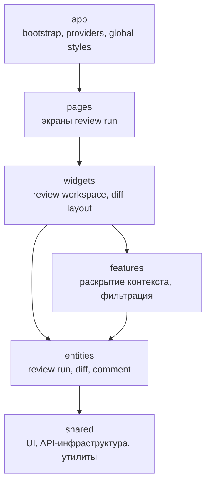
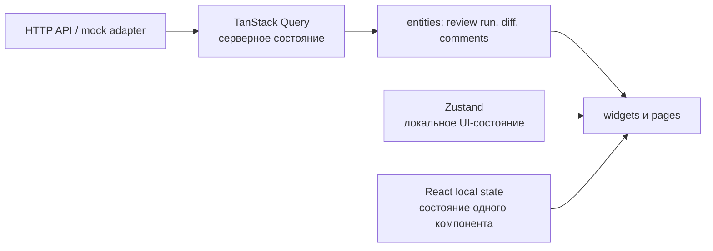

# Архитектура фронтенда DMC-268

## Назначение

Фронтенд реализует пользовательский интерфейс сервиса AI code review. Основной сценарий — просмотр прогона ревью: его статуса, изменений в коде, контекста вокруг изменений и inline-замечаний AI-ревьюера.

Этот документ задаёт целевую структуру будущего приложения и границы ответственности. Он не добавляет зависимости и не описывает уже реализованные UI-экраны.

## Принятая платформа

В качестве исходной базы используется [PR #4 «Базовый каркас фронтенда с линтингом, тестами и Husky»](https://github.com/larchanka-training/dmc-268-ui-t1/pull/4). Решения из него считаются принятыми и не пересматриваются в этой задаче:

| Область | Принятое решение | Роль |
| --- | --- | --- |
| Пакетный менеджер и runtime | pnpm, Node.js 22 | Воспроизводимая установка зависимостей и единое окружение разработки. |
| Базовый стек | React, TypeScript, Vite | Компонентный UI, типобезопасные модели и быстрая сборка/разработка. |
| Стилизация | Tailwind CSS v4 | Единый способ собирать адаптивные интерфейсы для diff- и code-review-экранов. |
| Качество кода | ESLint, Prettier, Stylelint, Git hooks | Автоматические проверки стиля и качества до отправки изменений. |
| Тестирование | Vitest, React Testing Library, jsdom | Unit- и interaction-тесты компонентов без необходимости запускать браузер вручную. |

Tailwind CSS v4 уже является styling/UI foundation проекта. Поэтому shadcn/ui, Ant Design и другие UI-киты в рамках этой архитектурной задачи не выбираются и не подключаются. Повторно используемые UI-элементы будут составляться из React-компонентов и utility-классов Tailwind.

## Структура приложения

Для роста продукта принимается **Feature-Sliced Design (FSD)**. Подход отделяет предметные сущности code review от пользовательских действий и составных областей экрана: изменение компонента отображения дифа не должно требовать изменений в сетевом слое или сценарии фильтрации.

| Слой | Ответственность | Примеры будущих модулей |
| --- | --- | --- |
| `app` | Точка входа, провайдеры, глобальные стили и конфигурация приложения. | Query provider, глобальные Tailwind-стили. |
| `pages` | Компоновка полноценного пользовательского маршрута. | `review-run` — экран одного прогона ревью. |
| `widgets` | Крупные, самостоятельные области страницы. | Рабочая область review, список файлов, панель summary. |
| `features` | Завершённые пользовательские действия. | Раскрытие контекста дифа, фильтрация замечаний по severity. |
| `entities` | Предметные данные и их отображение без сценарной логики. | `review-run`, `diff`, `review-comment`. |
| `shared` | Переиспользуемый код без зависимости от предметной области. | Tailwind UI-композиции, API-клиент, formatters, общие типы. |

Направление импортов — только сверху вниз по слоям: модуль не импортирует код из более высокого слоя. Например, `entities/diff` не зависит от `widgets/review-workspace`.

## Управление состоянием

Разные категории состояния требуют разных инструментов. Это предотвращает смешение сетевого кэша и краткоживущего состояния интерфейса.

| Инструмент | Что хранит | Почему |
| --- | --- | --- |
| TanStack Query | Прогоны ревью, данные diff, summary и комментарии, полученные из API. | Предоставляет кэширование, состояния loading/error, повторное получение и инвалидацию серверных данных. |
| Zustand | Выбранный файл, раскрытые блоки контекста, активные фильтры и состояние панелей. | Лёгкое общее состояние UI, которое не является источником данных backend. |
| React local state | Hover, открытие одного popover, состояние поля ввода и другие значения одного компонента. | Не создаёт глобальный store для состояния, которое не нужно соседним компонентам. |

До появления согласованного backend-контракта UI может получать данные через типизированный mock adapter. Он должен реализовывать ту же границу, что и будущий HTTP-клиент; компоненты не должны зависеть от способа получения данных.

## Доменные модели

Следующие типы определяют минимальный контракт между API/mock adapter и UI:

| Модель | Основные данные | Используется в |
| --- | --- | --- |
| `ReviewRun` | Идентификатор, статус, время запуска/завершения, summary и связанные файлы. | Страница прогона, `ReviewRunStatus`, summary. |
| `DiffFile` | Путь, язык/расширение, список hunks и статистика изменений. | Список файлов, `DiffViewer`. |
| `DiffHunk` | Заголовок блока, диапазоны старых и новых строк, строки изменения. | `DiffHunk`, `ContextExpander`. |
| `DiffLine` | Тип `added`/`removed`/`context`, номера старой и новой строки, текст и признак скрытого контекста. | `CodeBlock`, строка дифа. |
| `ReviewComment` | Идентификатор, файл, новая строка, severity, текст, автор и состояние обсуждения. | `ReviewCommentThread`, фильтрация замечаний. |

## Базовые UI-компоненты

| Компонент | Назначение | Входные данные и связь с моделями |
| --- | --- | --- |
| `CodeBlock` | Контейнер с моноширинным шрифтом, нумерацией и прокруткой для исходного кода. | Кодовые строки, язык и настройки отображения; используется `DiffViewer` и контекстом комментария. |
| `DiffViewer` | Отображает изменения одного или нескольких `DiffFile`. | `DiffFile[]`, выбранный файл и комментарии, привязанные к строкам. |
| `DiffHunk` | Показывает один логический блок изменений и его заголовок. | `DiffHunk`, включая диапазоны строк и `DiffLine[]`. |
| `DiffLine` | Отрисовывает одну added, removed или context-строку с нужным фоном и номерами. | Объект `DiffLine`; служит точкой привязки `ReviewComment`. |
| `ReviewCommentThread` | Показывает inline-замечание и последующий тред обсуждения. | `ReviewComment` и список ответов; располагается рядом с целевой строкой нового diff. |
| `ContextExpander` | Раскрывает скрытые строки до или после изменённого блока. | Идентификатор скрытого диапазона из `DiffHunk`; записывает состояние раскрытия в Zustand. |
| `ReviewRunStatus` | Наглядно сообщает этап прогона: `queued`, `in_progress`, `completed` или `failed`. | `ReviewRun.status`; используется в заголовке и списках запусков. |

Базовые визуальные композиции, реализуемые средствами Tailwind, — `Button`, `StatusBadge`, `Panel/Card`, `ScrollableContainer` и `CollapsibleSection`. Они не содержат доменной логики и остаются в `shared/ui`.

## Будущий поток данных

1. `pages/review-run` запрашивает `ReviewRun` через entity-level query hook.
2. TanStack Query получает данные из HTTP API либо временного mock adapter и хранит серверный кэш.
3. `widgets/review-workspace` передаёт `DiffFile`, `DiffHunk` и `ReviewComment` в базовые UI-компоненты.
4. Zustand хранит выбранный файл, фильтры и раскрытые участки контекста, не дублируя данные review run.
5. Пользовательские действия оформляются как `features` и изменяют локальное UI-состояние либо запускают query mutation после появления backend API.

Такое разделение соответствует сценарию AI code review: diff остаётся центральным источником правок, локальный контекст раскрывается по запросу, а замечания привязаны к конкретным строкам изменённого кода.
