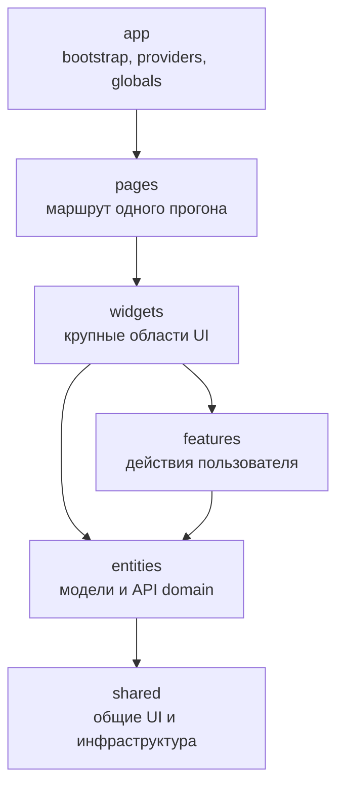

# Архитектура frontend — AI Code Review

**Статус:** черновик для согласования с backend-командой.  
**Редакция:** 23 сентября 2026 года.  
**Назначение:** этот документ описывает целевую архитектуру Web UI: слои, состояние, UI-систему, контракт данных и требования frontend к API. Он не добавляет зависимости, не меняет базовый setup и не является описанием уже реализованного интерфейса.

Документ использует 12-раздельный шаблон arc42 для описания архитектуры. Feature-Sliced Design (FSD) — отдельное решение о структуре frontend-кода.

## 1. Введение и цели

### 1.1. Пользовательский сценарий

Основной сценарий первой версии — просмотр одного прогона AI-ревью (`ReviewRun`). Пользователь открывает запуск и видит:

- статус, проверенный commit и сводку результата;
- список files проверенного PR;
- diff выбранного файла, hunks и строки;
- findings AI и статус их публикации.

`ReviewWorkspace` с файлами, diff и inline-findings — плановая поставка Sprint 2. Он появляется в UI после реализации backend diff pipeline и его API.
`RunInspector` с технической историей worker входит в первую версию только
после решения FE-OPEN-10.

`ReviewWorkspace` похож на вкладку _Files changed_ у PR-провайдера, но
показывает снимок именно того diff и тех findings, которые относятся к
выбранному `ReviewRun`. Это не копия интерфейса GitHub и не смешивает
комментарии людей, других ботов или последующих запусков.

### 1.2. Цели

- Точно отобразить diff и inline-finding на целевой строке.
- Сохранить читаемость при большом числе файлов и hunks.
- Разделить серверные данные, UI-состояние и локальное состояние компонента.
- Позволить подключить backend API без переписывания UI.
- После решения FE-OPEN-10 дать диагностический trace прогона без раскрытия исходного кода, секретов и полного LLM-payload по умолчанию.

### 1.3. Вне scope этой редакции

Список репозиториев, список PR, история запусков на странице PR, login, landing, профиль, настройки профиля, Stripe и billing не проектируются как экраны и компоненты в этой задаче. В рамках этой задачи для них не создаются маршруты, виджеты, features, entity-компоненты, формы или mock API. Backend-модель уже связывает `Repository → MergeRequest → ReviewRun`; этого достаточно, чтобы добавить эти сценарии позже без изменения модели просмотра одного запуска.

## 2. Ограничения

| ID        | Статус    | Ограничение                                                                                                                                                                                    |
| --------- | --------- | ---------------------------------------------------------------------------------------------------------------------------------------------------------------------------------------------- |
| FE-CON-01 | confirmed | Базовая основа из `develop`: pnpm, Node.js 22, React, TypeScript, Vite, Tailwind CSS v4, ESLint, Prettier, Stylelint, Vitest и React Testing Library.                                          |
| FE-CON-02 | confirmed | Git hooks работают через `.githooks` и `core.hooksPath`; Husky не используется.                                                                                                                |
| FE-CON-03 | accepted  | UI строится на Tailwind CSS v4 и Headless UI. Tailwind отвечает за стиль, Headless UI — за доступное интерактивное поведение. Ant Design, shadcn/ui и другой визуальный UI-kit не добавляются. |
| FE-CON-04 | accepted  | Серверные данные хранятся в TanStack Query; общий UI-state — в Zustand; состояние одного компонента — в React state.                                                                           |
| FE-CON-05 | accepted  | React Hook Form, Zod и `@hookform/resolvers` используются для будущих форм. Zod также валидирует API DTO на границе frontend.                                                                  |
| FE-CON-06 | confirmed | Пока backend API не готов, UI получает типизированные данные через mock adapter с теми же публичными типами, что и HTTP-клиент.                                                                |
| FE-CON-07 | open      | Полная модель `review_run_actions` и правила доступа к trace ожидают согласования с backend.                                                                                                   |
| FE-CON-08 | accepted  | Публичный API имеет префикс `/api/v1` и использует `snake_case`, совпадающий с текущей backend-моделью.                                                                                        |
| FE-CON-09 | accepted  | Активный run обновляется polling-запросом; SSE не входит в первую версию.                                                                                                                      |
| FE-CON-10 | confirmed | Backend PR #5 хранит `base_sha` вместе с неизменяемым `head_sha` у `ReviewRun`; worker Sprint 2 обязан заполнить обе revision до получения diff.                                               |

Принятые библиотеки могут отсутствовать в `package.json`: их подключение относится к отдельной реализации, а не к этому архитектурному документу.

## 3. Контекст и границы

```text
Пользователь в браузере
        │
        ▼
React Web UI ── HTTPS/JSON ──► Backend API
        │                          │
        ▼                          ├── Git provider
Tailwind + Headless UI             ├── review worker / LLM
                                   └── БД и защищённое хранилище payload
```

Frontend не читает БД, не клонирует репозитории, не получает Git-токены, не собирает LLM-контекст и не публикует комментарии в GitHub напрямую. Эти обязанности принадлежат backend.

Frontend получает только подготовленные API-данные. Право показать diff или trace проверяется backend на каждом соответствующем запросе.

## 4. Стратегия решения

### 4.1. Структура кода

Код организуется по **Feature-Sliced Design (FSD)**:


```mermaid
flowchart TB
  app[app\nbootstrap, providers, globals]
  pages[pages\nмаршрут одного прогона]
  widgets[widgets\nкрупные области UI]
  features[features\nдействия пользователя]
  entities[entities\nмодели и API domain]
  shared[shared\nобщие UI и инфраструктура]

  app --> pages
  pages --> widgets
  widgets --> features
  widgets --> entities
  features --> entities
  entities --> shared
```

Импорт разрешён только вниз по слоям. Внешний импорт из слайса идёт через его `index.ts`; `shared` не импортирует code-review сущности.

```text
src/
├── app/
│   ├── providers/                 # QueryClient, ErrorBoundary
│   ├── router/                    # React Router и маршруты страниц
│   ├── mocks/                     # временный типизированный adapter
│   └── styles/
├── pages/
│   └── review-run/                # ReviewRunPage
├── widgets/
│   ├── review-workspace/          # FileList + DiffViewer
│   ├── review-summary/
│   └── run-inspector/
├── features/
│   └── filter-findings/
├── entities/
│   ├── review-run/
│   ├── diff/
│   ├── review-finding/
│   └── review-run-action/         # после согласования API trace
└── shared/
    ├── api/                       # transport и базовые ошибки
    ├── config/
    ├── lib/
    └── ui/                        # нейтральные примитивы проекта
```

### 4.2. UI-система

`shared/ui` содержит независимые от code-review обёртки: `Button`, `Dialog`, `Menu`, `Select`, `CollapsibleSection`, `StatusBadge`, `ScrollableContainer`, `LoadingState`, `EmptyState`, `ErrorState` и `Toast`.

Headless UI используется там, где нужны навигация с клавиатуры, управление фокусом, ARIA и доступное интерактивное поведение. В `shared/ui` не размещаются `DiffViewer`, finding, логика PR или API конкретной сущности.

## 5. Представление строительных блоков

### 5.1. Композиция страницы

Окончательный layout — вкладки, колонки, секции или отдельные маршруты — намеренно не выбирается сейчас. Независимые компоненты должны быть готовы к любому из этих вариантов.

```text
ReviewRunPage
├── RunHeader
├── ReviewSummary
├── ReviewWorkspace                 # после готовности diff API Sprint 2
│   ├── FileList
│   └── DiffViewer
│       └── DiffHunk
│           └── DiffLine
│               └── ReviewCommentThread
└── RunInspector                    # только после решения FE-OPEN-10
    └── ActionTree
        └── request / response выбранного действия
```

| Компонент             | Назначение                                                                             | Основные данные                                          |
| --------------------- | -------------------------------------------------------------------------------------- | -------------------------------------------------------- |
| `ReviewRunPage`       | Контейнер конкретного `runId`; загружает summary, diff и выбранные командой виджеты.   | `ReviewRun`, findings, diff; actions — после FE-OPEN-10. |
| `RunHeader`           | Метаданные прогона: статус, commit, модель, время, длительность, безопасная ошибка.    | `ReviewRun`.                                             |
| `ReviewSummary`       | Количество findings, severity, опубликованные комментарии, отклонённые findings.       | `ReviewRun`, `ReviewFinding[]`, `PublishedComment[]`.    |
| `ReviewWorkspace`     | Результат ревью: изменённые файлы и их diff; появляется после готовности API Sprint 2. | `DiffFile[]`, findings.                                  |
| `FileList`            | Список изменённых файлов и количество findings; выбирает файл.                         | `DiffFileSummary[]`, `selectedFile`.                     |
| `DiffViewer`          | Показывает **один выбранный** `DiffFile`, не массив viewers.                           | `DiffFile`, `ReviewFinding[]`.                           |
| `DiffHunk`            | Непрерывный блок изменений с заголовком `@@`.                                          | `DiffHunk`.                                              |
| `DiffLine`            | Добавленная, удалённая или контекстная строка с номерами old/new.                      | `DiffLine`.                                              |
| `ReviewCommentThread` | Показывает finding у строки и статус его публикации в Git-provider.                    | `ReviewFinding`, `PublishedComment?`.                    |
| `RunInspector`        | Технический trace запуска; создаётся после FE-OPEN-10.                                 | `ReviewRun`, `ReviewRunAction[]`.                        |
| `ActionTree`          | Хронология действий; одинаковые соседние tools могут группироваться в UI.              | `ReviewRunAction[]`, выбранный action.                   |

### 5.2. Что показывает `ReviewWorkspace`

`ReviewWorkspace` показывает **все изменённые файлы проверенного PR**, но рендерит diff одного выбранного файла за раз. Файлы без findings также видны: это позволяет понять покрытие запуска. Внутри diff показываются только нормализованные findings, связанные с линией. Полный raw-ответ LLM не вставляется рядом с каждой строкой.

Finding без корректной привязки к строке отображается в `ReviewSummary`, а не искусственно размещается в `ReviewCommentThread`.

## 6. Представление выполнения

### 6.1. Открытие завершённого прогона

1. React Router сопоставляет маршрут `/review-runs/:runId` со страницей `ReviewRunPage`.
2. Entity-level hooks TanStack Query запрашивают run, findings и опубликованные комментарии.
3. После готовности diff API Sprint 2 hooks дополнительно запрашивают список файлов и diff выбранного файла; `ReviewWorkspace` показывает `LoadingState`, `ErrorState` или данные без ручного `fetch` в компонентах.
4. Пользователь выбирает файл; Zustand меняет только `selectedFile`, а TanStack Query получает его diff.
5. `DiffViewer` размещает finding рядом с его `old_line` или `new_line`.

### 6.2. Прогон в процессе

1. API возвращает нетерминальный статус `ReviewRun`.
2. Пока статус нетерминальный, TanStack Query обновляет run polling-запросом; после терминального статуса polling прекращается.
3. UI отображает только серверный статус; frontend не делает вывод о завершении самостоятельно.
4. При наличии action API `RunInspector` получает новые завершённые действия в том же query-кэше.

### 6.3. Просмотр технического действия после FE-OPEN-10

1. `ActionTree` показывает безопасные `tool`, время, длительность и статус записи.
2. При выборе действия UI показывает `request_preview` и `response_preview`.
3. Полный payload запрашивается по `response_ref` только при наличии backend-разрешения и только если он не истёк по retention policy.

## 7. Представление развёртывания

Vite собирает статические assets; существующий Docker/nginx/Terraform-контур отдаёт их браузеру. В bundle попадают только публичные переменные окружения с префиксом `VITE_`, например `VITE_API_BASE_URL`.

Git-токены, ключи LLM, Stripe secret key, полный context и raw-action payload не попадают в environment frontend, bundle или browser logs.

## 8. Сквозные концепции

### 8.1. Состояние

| Данные                                                                                 | Владелец          | Пример ключа / store                   |
| -------------------------------------------------------------------------------------- | ----------------- | -------------------------------------- |
| Детали прогона                                                                         | TanStack Query    | `['review-runs', runId]`               |
| Список файлов (после готовности diff API Sprint 2)                                     | TanStack Query    | `['review-runs', runId, 'files']`      |
| Diff файла (после готовности diff API Sprint 2)                                        | TanStack Query    | `['review-runs', runId, 'diff', path]` |
| Findings и публикации                                                                  | TanStack Query    | `['review-runs', runId, 'findings']`   |
| Trace действий (после FE-OPEN-10)                                                      | TanStack Query    | `['review-runs', runId, 'actions']`    |
| Выбранный файл, фильтры severity, раскрытые hunks (после готовности diff API Sprint 2) | Zustand в виджете | `review-workspace/model/store`         |
| hover, открытый popover, ввод одного поля                                              | React state       | владелец компонента                    |

Серверные данные никогда не копируются в Zustand. Store хранит только пользовательский выбор и краткоживущее представление.

### 8.2. Контракт данных

Источник истины для runtime DTO — будущие Zod-схемы в `entities/*/model`. Публичный API использует `snake_case`, совпадающий с текущими именами backend. При необходимости frontend преобразует валидный API DTO в удобную для компонента модель внутри entity API adapter.

```ts
type ReviewRun = {
  id: string
  merge_request_id: string
  head_sha: string
  base_sha: string | null
  status:
    | 'queued'
    | 'building_context'
    | 'analysing'
    | 'publishing'
    | 'completed'
    | 'failed'
    | 'cancelled'
  trigger: 'webhook' | 'manual' | 'mention'
  created_at: string
  updated_at: string
  last_progress_at: string
  failure_reason: string | null
  model: string | null
  tokens_used: number | null
  duration_seconds: number | null
  rejected_findings: number
  change_request: ChangeRequestLink | null
}

type ChangeRequestLink = {
  provider: 'github' | 'gitlab'
  url: string
}

type ReviewFinding = {
  id: string
  review_run_id: string
  file_path: string
  side: 'old' | 'new'
  old_line: number | null
  new_line: number | null
  category: 'security' | 'correctness' | 'performance' | 'readability'
  severity: 'low' | 'medium' | 'high' | 'critical'
  message: string
  suggestion: string | null
  confidence: number | null
}

type PublishedComment = {
  id: string
  review_run_id: string
  finding_id: string | null
  provider_comment_id: string
  kind: 'summary' | 'inline'
  published_at: string
}

type DiffFileSummary = {
  path: string
  previous_path: string | null
  status: 'added' | 'modified' | 'deleted' | 'renamed'
  additions: number
  deletions: number
  findings_count: number
  is_binary: boolean
}

type DiffFile = {
  path: string
  previous_path: string | null
  status: 'added' | 'modified' | 'deleted' | 'renamed'
  is_binary: boolean
  language: string | null
  hunks: DiffHunk[]
}

type DiffHunk = {
  header: string
  old_start: number
  old_count: number
  new_start: number
  new_count: number
  lines: DiffLine[]
}

type DiffLine = {
  kind: 'added' | 'removed' | 'context'
  old_line: number | null
  new_line: number | null
  content: string
}
```

`ReviewFinding` — результат модели после валидации и дедупликации; `PublishedComment` — факт публикации этого finding у Git-provider. Они не являются одной сущностью. `ReviewCommentThread` получает finding и, при наличии, публикационный статус.

`DiffFile`, `DiffHunk` и `DiffLine` должны приходить как snapshot, относящийся к паре `ReviewRun.base_sha` и `ReviewRun.head_sha`. Frontend не извлекает diff из внутреннего LLM-payload и не рассчитывает diff по текущему состоянию PR.

### 8.3. Контракт trace: `ReviewRunAction`

`RunInspector` требует историю отдельных действий worker. Для этой задачи ему не нужен сохранённый diff: inspector объясняет ход работы (например, `get_diff → read_file → call_llm`), а не отображает код построчно. В backend PR #5 такой таблицы пока нет: там есть `context_payloads`, которые хранят chunks контекста, переданные модели.

`context_payloads` и `review_run_actions` не должны заменять друг друга. Первое нужно для воспроизводимости входа LLM и переиспользования контекста, второе — для диагностики шагов worker. В [обсуждении backend PR #5](https://github.com/larchanka-training/dmc-268-api-t1/pull/5#discussion_r4057422261) @Grinv предложил оставить обе сущности; команде нужно явно подтвердить это решение и решить, входит ли журнал действий в первую версию.

Предлагаемый DTO и будущая сущность:

```ts
type ReviewRunAction = {
  id: string
  run_id: string
  position: number
  tool: string
  status: 'running' | 'completed' | 'failed'
  request_preview: unknown | null
  response_preview: unknown | null
  response_ref: string | null
  error: { code: string; message: string } | null
  started_at: string
  duration_seconds: number | null
}
```

```text
review_runs 1 ─── N review_run_actions

review_run_actions
├── id
├── review_run_id
├── position              # стабильный порядок в одном run
├── tool                  # get_diff, get_tree, read_file, build_context, call_llm, post_review
├── status
├── request_preview JSONB
├── response_preview JSONB
├── response_ref NULL     # большой payload отдельным защищённым запросом
├── error_code NULL
├── error_message NULL
├── started_at
└── duration_seconds NULL
```

`ActionTree` может сам сгруппировать подряд идущие действия с одинаковым `tool`; отдельная parent-child таблица для первой версии не нужна. Поле `position` обязательно для воспроизводимой хронологии.

### 8.4. Безопасность и хранение исходного кода

`response_ref` уменьшает размер обычного API-ответа, но сам по себе не решает вопрос хранения кода. Исходники, prompt и raw LLM-output могут содержать интеллектуальную собственность, персональные данные или секреты.

| Категория         | Правило                                                                                                               |
| ----------------- | --------------------------------------------------------------------------------------------------------------------- |
| Итоговые данные   | `ReviewRun`, findings и сведения о публикации хранятся по утверждённой политике хранения.                             |
| Код и raw payload | Хранятся отдельно от основной записи run, шифруются, имеют ограниченный TTL и удаляются автоматически.                |
| Preview           | В `review_run_actions` попадает только очищенное и ограниченное по размеру preview.                                   |
| Секреты           | Токены, пароли, ключи и чувствительные фрагменты маскируются до логирования и записи.                                 |
| Доступ            | Backend проверяет права на run, diff, context и полный response; frontend не является границей безопасности.          |
| Внешний LLM       | Условия передачи кода, регион обработки, использование для обучения и DPA определяются владельцем продукта и юристом. |

## 9. Требования frontend к API

Эти требования описывают необходимую для UI публичную границу; они не означают, что endpoints уже реализованы.

| Endpoint                                                        | Ответ                                    | Назначение                                                                       |
| --------------------------------------------------------------- | ---------------------------------------- | -------------------------------------------------------------------------------- |
| `GET /api/v1/review-runs/{run_id}`                              | `ReviewRun` + ссылка на change request   | Заголовок и статус страницы; polling активного run.                              |
| `GET /api/v1/review-runs/{run_id}/files`                        | `DiffFileSummary[]`                      | План Sprint 2: `FileList` изменённых файлов snapshot.                            |
| `GET /api/v1/review-runs/{run_id}/diff?path=…`                  | `DiffFile`                               | План Sprint 2: `DiffViewer` одного выбранного файла.                             |
| `GET /api/v1/review-runs/{run_id}/findings`                     | `ReviewFinding[]` + `PublishedComment[]` | Summary и статус публикации; inline-рендеринг после готовности diff API.         |
| `GET /api/v1/review-runs/{run_id}/actions`                      | `ReviewRunAction[]`                      | Только после FE-OPEN-10: `ActionTree` технической истории worker.                |
| `GET /api/v1/review-runs/{run_id}/actions/{action_id}/response` | большой очищенный payload                | Только авторизованный запрос по `response_ref`; `404`/`410` допустимы после TTL. |

### 9.1. Требование к неизменяемости diff

В [backend PR #5](https://github.com/larchanka-training/dmc-268-api-t1/pull/5)
уже хранится у `ReviewRun` пара `base_sha` и неизменяемый
`head_sha`. Для каждого нового run worker Sprint 2 обязан зафиксировать обе
revision до загрузки diff; по этой паре VCS-клиент воспроизводит проверенный
diff, а не текущее состояние PR. Raw patch хранить необязательно.

`base_sha` nullable только у runs, созданных до миграции. Если его нет, UI не
показывает `ReviewWorkspace` и объясняет, что snapshot этого исторического run
недоступен. Модель данных готова, но parser diff и endpoints `/files` и `/diff`
ещё должны быть реализованы в Sprint 2.

### 9.2. API-boundary

HTTP-клиент возвращает `unknown`; entity API валидирует DTO Zod-схемой и только после этого отдаёт типизированную модель в query hook. API DTO не смешивается с props UI без явного mapping.

## 10. Решения и открытые вопросы

### 10.1. Принятые решения

| ID        | Решение                                                                                                                           |
| --------- | --------------------------------------------------------------------------------------------------------------------------------- |
| FE-DEC-01 | FSD: `app → pages → widgets → features → entities → shared`.                                                                      |
| FE-DEC-02 | Tailwind CSS v4 + Headless UI; общие примитивы проекта — в `shared/ui`.                                                           |
| FE-DEC-03 | TanStack Query для server-state, Zustand для общего UI-state, React state для локального состояния.                               |
| FE-DEC-04 | Zod на API boundary; React Hook Form + Zod для будущих форм.                                                                      |
| FE-DEC-05 | `ReviewWorkspace` — плановая поставка Sprint 2; он отображает все изменённые файлы, но `DiffViewer` рендерит один выбранный файл. |
| FE-DEC-06 | `RunInspector` и `ReviewWorkspace` — независимые виджеты; их будущий layout не фиксируется.                                       |
| FE-DEC-07 | React Router владеет маршрутом `/review-runs/:runId`; подключение библиотеки относится к реализации.                              |
| FE-DEC-08 | Активный run обновляется polling-запросом к detail endpoint; SSE отложен.                                                         |
| FE-DEC-09 | Внешний API использует `/api/v1` и `snake_case`, совпадающий с backend DTO.                                                       |

### 10.2. Незакрытые решения по `review_run_actions`

| ID         | Вопрос                                                                     | Почему нужен ответ                                                                                                                                                                                                   |
| ---------- | -------------------------------------------------------------------------- | -------------------------------------------------------------------------------------------------------------------------------------------------------------------------------------------------------------------- |
| FE-OPEN-01 | Подтверждаем ли сосуществование `review_run_actions` и `context_payloads`? | В backend-обсуждении предложено оставить обе сущности: `context_payloads` хранит вход LLM, журнал действий отвечает на другой вопрос. Это нужно формально зафиксировать, а не удалить одну таблицу по недоразумению. |
| FE-OPEN-02 | Какие `tool` допустимы и кто владеет их словарём?                          | UI может показать неизвестный tool, но analytics, локализация и группировка требуют стабильных имён.                                                                                                                 |
| FE-OPEN-03 | Нужны ли action-level статусы и ошибки?                                    | Без них inspector плохо объясняет текущий или упавший запуск.                                                                                                                                                        |
| FE-OPEN-04 | Какой максимальный размер preview и где хранится полный payload?           | Нужен баланс между полезностью trace, стоимостью и безопасностью.                                                                                                                                                    |
| FE-OPEN-05 | Какой TTL для diff, context, prompt и raw LLM-response?                    | Это требование защиты данных и стоимости хранения, а не UI-деталь.                                                                                                                                                   |
| FE-OPEN-06 | Кто имеет доступ к полному `response_ref`?                                 | Требуется RBAC/проверка прав на backend.                                                                                                                                                                             |
| FE-OPEN-07 | Нужен ли raw prompt и raw ответ LLM в первой версии?                       | Для результата ревью они не нужны; полезны только для ограниченной диагностики.                                                                                                                                      |

### 10.3. Решение команды о составе первой версии

`ReviewWorkspace` — согласованная поставка Sprint 2. Миграция backend PR #5
уже добавила недостающую base revision; реализация worker, parser и API
остаётся отдельной backend-работой. `RunInspector` по-прежнему нельзя оставлять
неявным будущим обещанием: для него в PR #5 нет ни таблицы действий, ни worker,
который её заполняет. Упоминание @Grinv указывает на автора поднятого в PR
вопроса, но не назначает его исполнителем.

| ID         | Что должна решить команда                                                      | Если делаем в первой версии                                                                                                                        | Если не делаем в первой версии                                                                                 |
| ---------- | ------------------------------------------------------------------------------ | -------------------------------------------------------------------------------------------------------------------------------------------------- | -------------------------------------------------------------------------------------------------------------- |
| FE-OPEN-10 | Нужен ли пользователю `RunInspector` — техническая хронология действий worker? | Backend добавляет `review_run_actions` одновременно с worker, который пишет действия; UI использует endpoints `/actions`. Diff snapshot не нужен.  | Убираем `RunInspector` и endpoints actions из scope v1; позднее возвращаемся к ним отдельной задачей.          |
| FE-OPEN-13 | Нужна ли ссылка из run на текущий change request у Git-провайдера?             | Backend возвращает готовый `change_request_url`: для GitHub это URL PR, для GitLab — URL MR; UI показывает ссылку без знания маршрутов провайдера. | UI не показывает внешнюю ссылку; не строит URL самостоятельно из provider, имени репозитория и номера запроса. |

Пара `base_sha` и `head_sha` теперь сохраняется для новых runs, поэтому
исторический diff можно воспроизвести после реализации VCS-клиента. Аналогично,
без записи действий во время выполнения inspector позже не сможет достроить их
задним числом.

## 11. Качество и проверка

| Область                                        | Проверяемый результат                                                                                      |
| ---------------------------------------------- | ---------------------------------------------------------------------------------------------------------- |
| Diff (после готовности API Sprint 2)           | Added, removed и context-строки имеют правильные номера; finding появляется у правильной стороны и строки. |
| File selection (после готовности API Sprint 2) | Выбор файла не дублирует diff в глобальном server-state и не заставляет рендерить все файлы сразу.         |
| Server state                                   | Loading, error, retry и обновления идут через TanStack Query.                                              |
| Inspector (после FE-OPEN-10)                   | Действия упорядочены по `position`; большой payload не загружается до явного открытия.                     |
| Accessibility                                  | Интерактивные shared-компоненты поддерживают клавиатуру, фокус и ARIA через Headless UI.                   |
| API boundary                                   | Некорректный DTO не попадает в UI: Zod возвращает контролируемую ошибку.                                   |

Для UI применяются Vitest и React Testing Library. Тесты проверяют наблюдаемое поведение пользователя, а не CSS-классы или внутреннюю структуру компонентов.

## 12. Глоссарий и ресурсы

| Термин             | Значение                                                                             |
| ------------------ | ------------------------------------------------------------------------------------ |
| `ReviewRun`        | Один неизменяемый запуск AI-ревью конкретного commit PR.                             |
| `DiffFile`         | Изменения одного файла в snapshot прогона.                                           |
| `DiffHunk`         | Непрерывный блок строк изменений.                                                    |
| `ReviewFinding`    | Нормализованный результат модели, переживший валидацию и дедупликацию.               |
| `PublishedComment` | Запись о публикации finding или summary у Git-provider.                              |
| `ReviewRunAction`  | Одно техническое действие worker внутри прогона.                                     |
| `RunInspector`     | UI технической истории действий; не основной результат ревью.                        |
| `response_ref`     | Ссылка на большой защищённый payload, который не входит в обычный ответ actions API. |

### Ресурсы

- [Issue #5 — Frontend Architecture](https://github.com/larchanka-training/dmc-268-ui-t1/issues/5)
- [PR #4 — базовый setup frontend](https://github.com/larchanka-training/dmc-268-ui-t1/pull/4)
- [PR #5 backend — архитектура и ERD](https://github.com/larchanka-training/dmc-268-api-t1/pull/5)
- [Комментарий frontend о `review_run_actions` в PR #5](https://github.com/larchanka-training/dmc-268-api-t1/pull/5#discussion_r4057422261)
- [Пример архитектурного документа команды T6](https://github.com/larchanka-training/dmc-268-ui-t6/blob/1cc57cd72009312c4a820d3bd15a72fcd67764b9/docs/FRONTEND_ARCHITECTURE.md)
- [arc42 — обзор шаблона](https://arc42.org/overview/)
- [TanStack Query](https://tanstack.com/query/latest/docs/framework/react/overview)
- [Zod](https://zod.dev/)
- [React Hook Form](https://react-hook-form.com/)
- [Headless UI](https://headlessui.com/)
- [Tailwind CSS](https://tailwindcss.com/)
