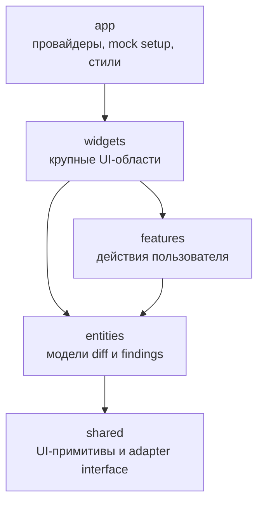

# Архитектура frontend — AI Code Review

**Статус:** черновик для [Issue #5](https://github.com/larchanka-training/dmc-268-ui-t1/issues/5).
**Подход:** arc42, сокращённый до границ задачи.

Документ следует 12 разделам arc42 настолько, насколько это уместно для
архитурного плана и mock UI. Он не определяет маршруты, HTTP API,
авторизацию, worker, очередь, хранение данных или deployment.

## 1. Введение и цели

### 1.1. Назначение

Нужны схема frontend-слоёв, выбор библиотек состояния и UI, mock состояния
приложения, базовые компоненты просмотра diff и технический просмотр одного
прогона.

Пользователь открывает один прогон ревью (`ReviewRun`) и видит его статус и
сводку, список изменённых файлов, diff одного выбранного файла, findings у
строк кода и хронологию действий прогона.

`RunInspector` предусмотрен по двум основаниям: он показан в материалах
Sprint 2, а backend-команда согласовала создание `review_run_actions` вместе с
worker. В merged backend PR #5 этой таблицы и её API ещё нет, поэтому в рамках
данной задачи Inspector работает на mock-данных и не задаёт backend-контракт.

### 1.2. Цели качества

- Компоненты diff пригодны для mock-данных сейчас и реального adapter позднее.
- Diff большого PR не рендерится целиком: viewer показывает только выбранный файл.
- Finding появляется только у корректной строки и стороны diff.
- Unified и side-by-side режимы используют один набор данных.
- Свёрнутый контекст раскрывается без отдельного компонента или нового формата данных.
- Технический trace не показывает полный исходный код, prompt или raw LLM-response по умолчанию.

### 1.3. Вне scope

Страницы и маршруты, HTTP API, polling, GitHub/GitLab integration, авторизация,
backend worker, очередь, LLM, хранение diff, `context_payloads`,
deployment и инфраструктура.

## 2. Ограничения

| ID        | Ограничение                                                                                                                                           |
| --------- | ----------------------------------------------------------------------------------------------------------------------------------------------------- |
| FE-CON-01 | Основа проекта: pnpm, Node.js 22, React, TypeScript, Vite, Tailwind CSS v4, ESLint, Prettier, Stylelint, Vitest и React Testing Library.              |
| FE-CON-02 | Git hooks работают через `.githooks`; Husky не используется.                                                                                          |
| FE-CON-03 | Документ и компоненты ограничены DoD Issue #5: FSD, библиотеки состояния/UI, mock состояния и Diff Viewer.                                            |
| FE-CON-04 | Backend PR #5 задаёт доменные значения `ReviewRun`, `Finding` и `PublishedComment`; frontend не меняет их семантику.                                  |
| FE-CON-05 | PR #5 не задаёт публичный DTO или API diff для браузера; до отдельного контракта Diff Viewer работает с mock adapter.                                 |
| FE-CON-06 | Backend согласовал, что `review_run_actions` создаётся вместе с worker. В merged PR #5 таблицы и API ещё нет; `RunInspector` использует mock adapter. |

## 3. Контекст и границы

```text
Пользователь
    │
    ▼
ReviewRunView
    ├── показывает метаданные ReviewRun
    ├── показывает Diff Viewer и findings
    └── показывает RunInspector и действия прогона
              │
              ▼
       mock adapter в этой задаче
```

Frontend не строит diff из Git-репозитория и не публикует комментарии. Он
получает подготовленные модели через adapter. Реальный источник этих моделей
находится за границей этой задачи.

## 4. Стратегия решения

### 4.1. Слои

Выбрана Feature-Sliced Design (FSD):


```mermaid
flowchart TB
  app[app\nпровайдеры, mock setup, стили]
  widgets[widgets\nкрупные UI-области]
  features[features\nдействия пользователя]
  entities[entities\nмодели diff и findings]
  shared[shared\nUI-примитивы и adapter interface]

  app --> widgets
  widgets --> features
  widgets --> entities
  features --> entities
  entities --> shared
```

Импорт разрешён только вниз. Каждый слайс предоставляет внешний импорт через
`index.ts`; `shared` не зависит от review-сущностей.

### 4.2. Библиотеки

| Область             | Решение         | Роль                                                            |
| ------------------- | --------------- | --------------------------------------------------------------- |
| Стили               | Tailwind CSS v4 | Оформление компонентов.                                         |
| Интерактивный UI    | Headless UI     | Доступное поведение popover, menu и раскрывающихся секций.      |
| Server state        | TanStack Query  | Получает модели из mock adapter и хранит их кэш.                |
| Общий UI-state      | Zustand         | Хранит выбор файла, фильтры, режим viewer и раскрытый контекст. |
| Локальное состояние | React state     | Хранит hover, focus и popover одного компонента.                |
| Валидация           | Zod             | Проверяет ответ adapter до передачи компонентам.                |

## 5. Представление строительных блоков

### 5.1. Структура кода

```text
src/
├── app/
│   ├── providers/                 # QueryClient, ErrorBoundary
│   ├── mocks/                     # данные и mock adapter
│   └── styles/
├── widgets/
│   ├── review-run-view/           # RunHeader + ReviewSummary
│   ├── review-workspace/          # FileList + DiffViewer
│   └── run-inspector/             # ActionTree + ActionDetails
├── features/
│   └── filter-findings/
├── entities/
│   ├── review-run/
│   ├── diff/
│   ├── review-finding/
│   ├── published-comment/
│   └── review-run-action/
└── shared/
    ├── api/                       # adapter interface и ошибки
    ├── lib/
    └── ui/                        # нейтральные UI-примитивы
```

### 5.2. Иерархия компонентов

```text
ReviewRunView
├── RunHeader
├── ReviewSummary
├── ReviewWorkspace
│   ├── FileList
│   └── DiffViewer
│       └── DiffHunk
│           └── DiffLine
│               └── ReviewCommentThread
└── RunInspector
    ├── ActionTree
    └── ActionDetails
```

| Компонент             | Зачем нужен                                                | Как работает                                                                                                                                          |
| --------------------- | ---------------------------------------------------------- | ----------------------------------------------------------------------------------------------------------------------------------------------------- |
| `ReviewRunView`       | Собирает экран одного прогона.                             | Получает типизированные mock-модели и передаёт их дочерним виджетам. Не отвечает за маршрут или загрузку из HTTP.                                     |
| `RunHeader`           | Показывает контекст результата.                            | Отображает статус, `head_sha`, время, модель, длительность и безопасную причину ошибки из `ReviewRun`.                                                |
| `ReviewSummary`       | Даёт краткий итог до чтения кода.                          | Считает findings по severity, отображает число отклонённых и статусы публикации.                                                                      |
| `ReviewWorkspace`     | Соединяет список файлов, viewer и findings.                | Читает `selected_file`, фильтры и `view_mode` из Zustand; передаёт anchor-привязанные findings в `DiffViewer`, не храня копию diff.                   |
| `FileList`            | Позволяет перейти к изменённому файлу.                     | Показывает путь, статус, additions/deletions и число findings; меняет `selected_file`.                                                                |
| `DiffViewer`          | Показывает код, который пользователь сейчас рассматривает. | Рендерит только один `DiffFile`; в unified режиме использует исходный порядок строк, в side-by-side раскладывает строки hunk в две колонки.           |
| `DiffHunk`            | Группирует непрерывное изменение.                          | Показывает заголовок `@@`, строки и свёрнутый context. Раскрытие context — часть этого компонента, отдельный `ContextExpander` не создаётся.          |
| `DiffLine`            | Делает строку diff доступной и читаемой.                   | Отображает old/new номер, added/removed/context стиль и передаёт совпавшие findings дальше.                                                           |
| `ReviewCommentThread` | Объясняет замечание ревьюера рядом с кодом.                | Получает finding от `DiffLine`, совпавший по `file_path`, `side` и номеру строки; показывает текст, severity, suggestion и статус `PublishedComment`. |
| `RunInspector`        | Показывает, что происходило внутри одного прогона.         | Получает упорядоченные mock-действия; не показывает diff, prompt, секреты или полный raw payload.                                                     |
| `ActionTree`          | Делает хронологию действий быстро читаемой.                | Показывает `tool`, статус, время и длительность; соседние одинаковые tools может визуально группировать.                                              |
| `ActionDetails`       | Даёт диагностику выбранного действия.                      | Показывает только очищенные `request_preview`, `response_preview` и ошибку; это универсальные preview, а не заранее определённые поля tool.           |

`DiffViewer` — явная часть задачи Sprint 2: он остаётся в архитектуре, даже
если backend-команде ещё нужно согласовать реальный источник diff. Mock adapter
позволяет реализовать и проверить UI до этого решения.

Anchor-привязанные findings показываются внутри `ReviewWorkspace`: `DiffLine`
находит их по `file_path`, `side` и номеру строки и рендерит
`ReviewCommentThread`. Finding без корректного anchor не вставляется в код и
остаётся в `ReviewSummary` как отдельный результат ревью.

`RunInspector` включён не как произвольное расширение scope: его показывали в
Sprint 2, а backend согласовал будущие `review_run_actions`. Он проектируется
на mock-данных и готовит UI к этой интеграции, но не требует, чтобы таблица,
API или worker были частью этого PR.

Если `is_binary: true`, viewer не пытается отображать файл как код. Например,
ZIP — binary-файл: показываются имя, статус и сообщение, что текстовый diff
недоступен.

## 6. Представление выполнения

В этой задаче описывается выполнение на mock-данных:

1. `ReviewRunView` получает состояние одного прогона, список файлов, diff и findings из mock adapter.
2. `FileList` устанавливает `selected_file`.
3. `DiffViewer` выбирает соответствующий `DiffFile` и отображает его hunks.
4. `DiffHunk` показывает скрытые context-строки по состоянию `expanded_context_line_ids`.
5. `DiffLine` сопоставляет строку с finding по `file_path`, `side` и номеру строки.
6. Изменение unified / side-by-side меняет только представление, а не исходные данные.
7. `ActionTree` сортирует действия по `position`; пользователь выбирает одно действие.
8. `ActionDetails` показывает только preview и ошибку выбранного действия.

## 7. Представление развёртывания

Решения о deployment, адресах backend и конфигурации окружений не входят в
Issue #5. Для этой задачи достаточно запуска существующего React/Vite проекта
с mock adapter.

## 8. Сквозные концепции

### 8.1. Mock состояния приложения

Этот блок требуется DoD задачи: он показывает, какие данные и пользовательский
выбор нужны компонентам до появления реального adapter.

| Данные                                                   | Владелец       | Пример состояния            |
| -------------------------------------------------------- | -------------- | --------------------------- |
| Один прогон, файлы, diff, findings, публикации и actions | TanStack Query | `['mock-review']`           |
| Выбранный файл                                           | Zustand        | `selected_file`             |
| Фильтры severity                                         | Zustand        | `severity_filters`          |
| Unified / side-by-side                                   | Zustand        | `view_mode`                 |
| Раскрытые context-строки                                 | Zustand        | `expanded_context_line_ids` |
| Выбранное действие                                       | Zustand        | `selected_action_id`        |
| Hover и popover строки                                   | React state    | состояние `DiffLine`        |

```ts
type MockReviewState = {
  run: ReviewRun
  files: DiffFileSummary[]
  diffs_by_path: Record<string, DiffFile>
  findings: ReviewFinding[]
  published_comments: PublishedComment[]
  actions: ReviewRunAction[]
}
```

### 8.2. Модели компонентов

`ReviewRun` повторяет поля и допустимые статусы merged backend PR #5, нужные
для шапки и summary. Diff-модели ниже — UI mock-модели: PR #5 не определяет их
как публичный browser-контракт.

```ts
type ReviewRun = {
  id: string
  head_sha: string
  status:
    | 'queued'
    | 'building_context'
    | 'analysing'
    | 'publishing'
    | 'completed'
    | 'failed'
    | 'cancelled'
  trigger: 'webhook' | 'manual' | 'mention'
  last_progress_at: string
  created_at: string
  updated_at: string
  failure_reason: string | null
  base_sha: string | null
  model: string | null
  tokens_used: number | null
  duration_seconds: number | null
  rejected_findings: number
}

type DiffFileSummary = {
  path: string
  previous_path: string | null
  status: 'added' | 'modified' | 'deleted' | 'renamed'
  additions: number
  deletions: number
  findings_count: number
  is_binary: boolean
}

type DiffFile = {
  path: string
  previous_path: string | null
  status: DiffFileSummary['status']
  is_binary: boolean
  language: string | null
  hunks: DiffHunk[]
}

type DiffHunk = {
  id: string
  header: string
  old_start: number
  old_count: number
  new_start: number
  new_count: number
  lines: DiffLine[]
}

type DiffLine = {
  id: string
  kind: 'added' | 'removed' | 'context'
  old_line: number | null
  new_line: number | null
  content: string
  is_collapsed_context: boolean
}

type ReviewFinding = {
  id: string
  file_path: string
  side: 'old' | 'new'
  old_line: number | null
  new_line: number | null
  category: 'security' | 'correctness' | 'performance' | 'readability'
  severity: 'low' | 'medium' | 'high' | 'critical'
  message: string
  suggestion: string | null
  confidence: number | null
}

type PublishedComment = {
  finding_id: string | null
  provider_comment_id: string
  kind: 'summary' | 'inline'
  published_at: string
}

type ReviewRunAction = {
  id: string
  review_run_id: string
  position: number
  tool: string
  status: 'running' | 'completed' | 'failed'
  request_preview: unknown | null
  response_preview: unknown | null
  error: { code: string; message: string } | null
  started_at: string
  duration_seconds: number | null
}
```

`ReviewRunAction` — mock-модель будущей истории worker, а не утверждённый API
контракт. `tool` выбирает код worker из закрытого сценария, а не LLM; UI
показывает неизвестное значение нейтрально, без предположений о его смысле.

`request_preview` и `response_preview` намеренно имеют тип `unknown | null`.
На этом этапе UI должен уметь безопасно показать JSON, текст, `null` или ошибку,
но не должен заранее планировать предметные поля каждого tool. Формат preview,
маскирование секретов, лимит размера и признак обрезки согласуются вместе с API
`review_run_actions`. Полные payload не показываются в `RunInspector` по
умолчанию. `context_payloads` не заменяется actions: payload отвечает за вход
модели, actions — за хронологию выполнения.

## 9. Архитектурные решения

| ID        | Решение                                                                                                      |
| --------- | ------------------------------------------------------------------------------------------------------------ |
| FE-DEC-01 | Используется FSD с направлением зависимостей `app → widgets → features → entities → shared`.                 |
| FE-DEC-02 | Tailwind CSS v4 + Headless UI составляют UI-основу; сторонний визуальный UI-kit не добавляется.              |
| FE-DEC-03 | TanStack Query хранит данные adapter, Zustand — общий UI-state, React state — состояние одного компонента.   |
| FE-DEC-04 | `DiffViewer` отображает один выбранный файл и поддерживает unified / side-by-side без изменения модели diff. |
| FE-DEC-05 | Свёрнутый context отображает `DiffHunk`; отдельный `ContextExpander` не создаётся.                           |
| FE-DEC-06 | До backend-контракта применяются Zod-валидируемые mock-модели и mock adapter.                                |
| FE-DEC-07 | `RunInspector` использует mock `ReviewRunAction[]`; actions и `context_payloads` не смешиваются.             |
| FE-DEC-08 | Inspector по умолчанию показывает только очищенные preview и ошибки, но не полный payload.                   |

## 10. Требования качества

| Область       | Проверяемый результат                                                                                        |
| ------------- | ------------------------------------------------------------------------------------------------------------ |
| Структура     | Импорты не нарушают направление FSD.                                                                         |
| File list     | Файлы без findings тоже видны; выбран ровно один файл.                                                       |
| Unified       | Added, removed и context строки имеют корректные номера и стили.                                             |
| Side-by-side  | Удалённые и добавленные строки одного hunk корректно сопоставлены по колонкам.                               |
| Context       | Раскрытие одного context-блока не раскрывает другой hunk.                                                    |
| Findings      | Finding появляется у корректной стороны и строки; finding без anchor не приклеивается к произвольной строке. |
| Binary        | ZIP и другие binary-файлы не отображаются как текст.                                                         |
| Inspector     | Действия упорядочены по `position`; выбор действия не загружает полный payload.                              |
| Accessibility | Переключатели, фильтры и раскрывающиеся элементы доступны с клавиатуры.                                      |

Используются Vitest и React Testing Library: тесты проверяют видимое поведение
и доступные роли, а не CSS-классы или внутреннюю реализацию.

## 11. Риски и технический долг

| Риск                                                                  | Последствие                                                                   | Действие в рамках этой задачи                                                            |
| --------------------------------------------------------------------- | ----------------------------------------------------------------------------- | ---------------------------------------------------------------------------------------- |
| Backend PR #5 не содержит browser DTO/API diff.                       | Mock нельзя механически заменить реальным ответом без согласованного adapter. | Изолировать модели и mock adapter в entity/shared-границе.                               |
| Не определено, нужен ли UI исторический snapshot или текущий diff PR. | Привязка findings после новых push может требовать отдельной политики.        | Не придумывать решение в frontend-документе; зафиксировать вопрос для команды.           |
| Крупный diff.                                                         | Много DOM-элементов и медленная страница.                                     | Рендерить один выбранный файл; виртуализацию оценить при реализации на реальных объёмах. |
| `review_run_actions` ещё нет в merged PR #5.                          | Inspector пока нельзя подключить к реальным данным.                           | Реализовать UI на mock adapter; согласовать DTO, когда worker и API будут готовы.        |

## 12. Глоссарий

| Термин             | Значение                                                        |
| ------------------ | --------------------------------------------------------------- |
| `ReviewRun`        | Один запуск AI-ревью конкретного commit.                        |
| Diff               | Представление изменений файла между двумя версиями.             |
| Hunk               | Непрерывный блок строк diff с заголовком `@@`.                  |
| Finding            | Нормализованное замечание ревьюера, привязанное к строке diff.  |
| `PublishedComment` | Запись о публикации finding или summary у провайдера.           |
| `ReviewRunAction`  | Одно техническое действие worker внутри прогона.                |
| `RunInspector`     | UI хронологии действий и безопасных preview одного прогона.     |
| Unified            | Режим, где added, removed и context строки идут в одном потоке. |
| Side-by-side       | Режим, где old и new стороны diff отображаются рядом.           |
