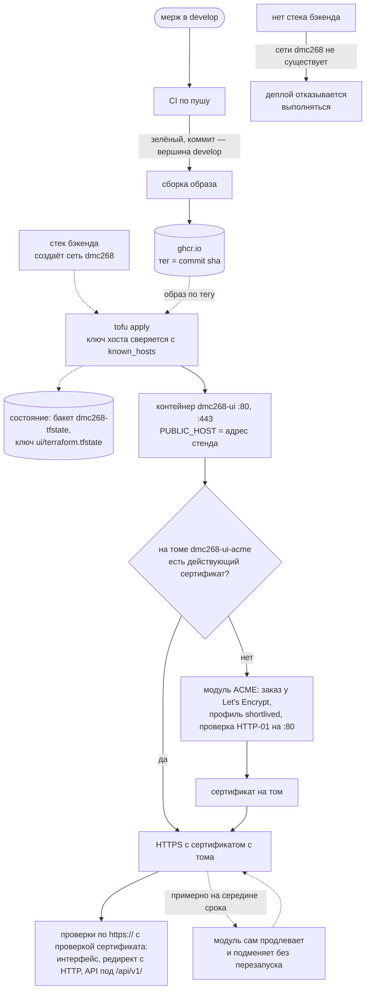
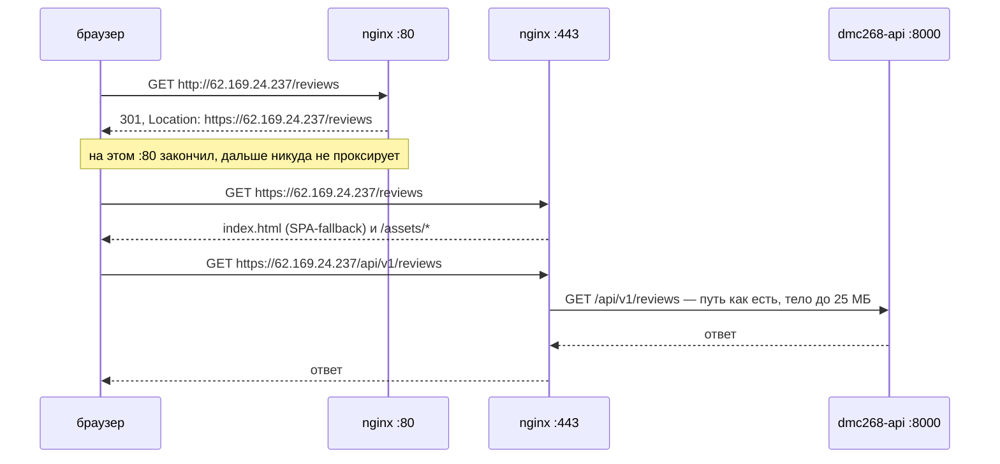
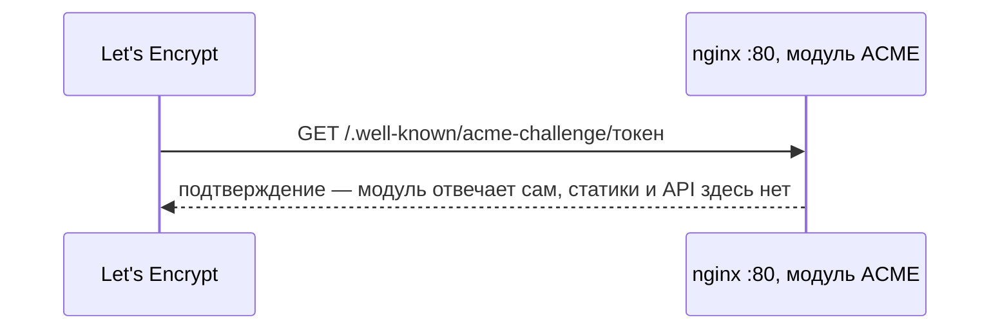

# Деплой UI (nginx + сборка Vite)

Нужны **Docker Engine** на целевом хосте и OpenTofu >= 1.12 (в CI ставится 1.12.6). Этот стек поднимает только фронтенд.

**Сначала примените `infra/` из `dmc-268-api-t1`.** UI подключается к сети `dmc268`, которую создаёт стек бэкенда, и проксирует `/api/` на контейнер `dmc268-api`. На чистом сервере развёртывание UI откажется выполняться — это требование спеки `frontend-delivery`, а не случайность реализации.

## Деплой

Штатный путь один: **мерж в `develop`**. Дальше всё делает `.github/workflows/deploy.yml` — собирает образ, публикует его в ghcr, открывает туннель к хранилищу состояния, применяет конфигурацию и проверяет по HTTPS, что по адресу отдаётся именно интерфейс, что HTTP перенаправляет на HTTPS и что API через него отвечает.



## HTTPS

Стенд отдаётся по **https://62.169.24.237**. Домена нет, поэтому сертификат выписан прямо на IP: Let's Encrypt выдаёт такие только с профилем `shortlived`, сроком 160 часов. Вручную с ним ничего делать не нужно.

Как браузер попадает к интерфейсу и API:



Отдельно, без участия браузера, — проверка владения адресом при выпуске и продлении сертификата:



Интерфейс и API отдаёт только `:443`. На `:80` браузер получает лишь `301`, а Let's Encrypt — ответ на проверку.

TLS снимает сам `nginx` интерфейса встроенным модулем [`ngx_http_acme_module`](https://nginx.org/en/docs/http/ngx_http_acme_module.html) — он уже есть в образе `nginx:1.30-alpine`. Модуль получает сертификат при первом старте, продлевает его до истечения и подменяет без перезапуска. Порт 80 он использует для проверки HTTP-01, остальные запросы на 80 перенаправляются на HTTPS.

Режим выбирает скрипт `nginx/select-site.sh` при старте контейнера по переменной `PUBLIC_HOST`:

| `PUBLIC_HOST`                      | Режим                            | Конфиг                      |
| ---------------------------------- | -------------------------------- | --------------------------- |
| задан (стенд, `public_tls = true`) | HTTPS на этот адрес, 80 → 443    | `nginx/https.conf.template` |
| не задан (локально, CI)            | HTTP на 80, без обращения к ACME | `nginx/http.conf`           |

Общие location — статика, `/api/`, SPA-fallback — лежат в `nginx/site.conf` и подключаются в оба режима.

Ключ ACME-аккаунта и сертификаты лежат на томе `dmc268-ui-acme`. Деплой пересоздаёт контейнер, но не том, поэтому сертификат заново не выпускается. **Не удаляйте этот том без нужды:** у Let's Encrypt лимит — пять одинаковых сертификатов в неделю, и при частых перевыпусках стенд останется без HTTPS до сброса лимита.

Если сертификат не продлился, а HTTPS отвечает ошибкой, смотрите лог контейнера: `docker logs dmc268-ui 2>&1 | grep -i acme`. Пробовать что-то на стенде лучше против staging Let's Encrypt — `acme_directory = "https://acme-staging-v02.api.letsencrypt.org/directory"`: у него свои, мягкие лимиты, но браузер его сертификату не доверяет.

## Как адресуется API

`nginx` внутри контейнера интерфейса передаёт запросы под `/api/` бэкенду **с исходным путём**:

```
location /api/ {
    proxy_pass $api_upstream;
}
```

Браузерный `GET /api/v1/reviews` приходит на бэкенд как `GET /api/v1/reviews`. Префикс `/api/v1` ставит само приложение — так записано в контракте API (`dmc-268-api-t1`, `docs/openapi/openapi.yaml`), и прокси его не трогает. Фронтенд обращается к `/api/v1/...` относительными путями, второй адрес ему не нужен.

`/health` через адрес интерфейса не публикуется: это проверка живости для Docker и деплоя бэкенда, она отвечает в корне приложения и ходит мимо `nginx`. Деплой интерфейса проверяет доступность API запросом под `/api/v1/`.

Переменная в `proxy_pass` нужна, чтобы `nginx` стартовал, когда `dmc268-api` ещё не резолвится. URI в `proxy_pass` при этом не указывается: с переменной `nginx` берёт его буквально, и `$api_upstream/` отправил бы любой запрос на `/`. Без URI передаётся исходный путь запроса.

Образ здесь не собирается: он публикуется в `ghcr.io/larchanka-training/dmc-268-ui-t1` с тегом по commit sha и забирается готовым (`ui_image`). Собирать на сервере значило бы отправлять туда исходники и терять кеш слоёв.

Переменные, без которых `apply` не пройдёт (в CI приходят через `TF_VAR_*`):

| Переменная                               | Откуда                                                                   |
| ---------------------------------------- | ------------------------------------------------------------------------ |
| `ui_image`                               | тег собранного образа                                                    |
| `registry_username`, `registry_password` | `github.actor` и `GITHUB_TOKEN`, живут один прогон                       |
| `docker_host`, `service_host`            | собираются из `VPS_DMC268_U` и `VPS_DMC268_IP_T1`                        |
| `bind_ip`, `ui_port`                     | `0.0.0.0` и `80`: на 80 идёт проверка HTTP-01 и перенаправление на HTTPS |
| `public_tls`                             | `true`, стенд отдаётся по HTTPS                                          |

`service_host` и `bind_ip` — разные вещи, и путать их нельзя: первый попадает в адрес для клиента, второй отвечает на вопрос «на каком интерфейсе слушать». `service_host` нельзя ставить в `0.0.0.0` — именно на этом выход `ui_url` раньше и оказывался бесполезным.

## Хранилище состояния

Состояние лежит в S3-совместимом хранилище на том же сервере (`backend.tf`), в бакете `dmc268-tfstate` под ключом `ui/terraform.tfstate` — отдельно от состояния бэкенда, чтобы применение одного стека не меняло состояние другого.

Хранилище слушает только петлю сервера, поэтому любая команда, которой нужно состояние, работает через туннель:

```bash
ssh -i <ключ> -o ExitOnForwardFailure=yes -f -N -L 9000:127.0.0.1:9000 <user>@<server>
export AWS_ACCESS_KEY_ID=<логин хранилища> AWS_SECRET_ACCESS_KEY=<пароль> AWS_DEFAULT_REGION=us-east-1
cd infra && tofu init && tofu plan
```

Само хранилище поднимает деплой бэкенда — здесь оно только используется. Ключ и учётные данные лежат в секретах GitHub и наружу не отдаются, так что у большинства их не будет; чтобы разрабатывать, разворачивать стенд не нужно.

Проверить конфигурацию без доступа к состоянию можно всегда:

```bash
cd infra && tofu fmt -check && tofu init -backend=false && tofu validate
```

## Версия провайдера

Точная версия `kreuzwerker/docker` и её хэши закреплены в `.terraform.lock.hcl`, файл коммитится. После смены `version` в `versions.tf` его пересобирают на все платформы команды, иначе `tofu init` на неперечисленной системе допишет в файл свои хэши и оставит изменение в рабочей копии:

```bash
cd infra && tofu init -backend=false -upgrade && tofu providers lock \
  -platform=linux_amd64 -platform=linux_arm64 \
  -platform=darwin_amd64 -platform=darwin_arm64 \
  -platform=windows_amd64
```

Выход: `ui_url`.
